# VoIP — Rádio Pelotense 99.5FM

Sistema de voz sobre IP (VoIP) de código aberto, com servidor em **Node.js + TypeScript** e cliente em **React + Vite + Tauri**.

## Visão geral

| Característica        | Valor                                             |
| --------------------- | ------------------------------------------------- |
| Controle / sinalização | WebSocket (WS e WSS)                              |
| Áudio / voz           | UDP (relay de pacotes, sem processamento/decodificação) |
| Persistência          | SQLite (`better-sqlite3`)                         |
| Frontend              | React 18 + Vite + Tauri + Zustand + Web Audio API |
| Backend               | Node.js + TypeScript + Fastify + ws + dgram       |

O servidor apenas **relaya** os pacotes de voz entre os clientes (não decodifica nem processa o áudio), mantendo a latência baixa.

---

## Acesso online

O cliente (frontend) está publicado no Netlify:

**[🔗 pelotense-voip.netlify.app](https://pelotense-voip.netlify.app)**

> O frontend aponta para o servidor de voz via o painel de conexão (host + porta WSS/WS). O backend roda separadamente (ex: Oracle Cloud / Docker).

---

## Expondo o servidor local (túneis: ngrok / Cloudflare)

Se você quiser rodar o **servidor na sua máquina** e deixar que **outras pessoas acessem pela internet** (sem abrir portas no roteador), use um túnel. O projeto já integra **ngrok** e **Cloudflare Tunnel (`cloudflared`)** automaticamente.

### Como funciona

- O servidor expõe o app (HTML/JS) na porta **3000** e o WebSocket na porta **3001** (WS puro) e **3003** (WSS/TLS).
- O túnel (ngrok/cloudflared) cria uma URL pública `https://…` e encaminha o tráfego para a sua máquina.
- O túnel **termina o TLS na borda dele** e repassa HTTP/WebSocket **puro** para o servidor — por isso os túneis apontam para a **porta 3000**, que serve o app **e** tem WebSocket próprio.
- Ao iniciar, o servidor:
  1. **Encerra túneis antigos** (evita links obsoletos).
  2. **Inicia o túnel** (ngrok e/ou cloudflared).
  3. **Loga a URL pública** (o link muda a cada execução).
  4. **Atualiza o `config.json` da raiz** automaticamente com o link novo — o app desktop usa esse arquivo.

### Como ativar

1. Instale o túnel que preferir:
   ```powershell
   winget install Cloudflare.cloudflared   # Cloudflare (recomendado, sem aviso no navegador)
   winget install ngrok.ngrok               # ou ngrok
   ```
2. No arquivo `server/.env`, configure:
   ```ini
   # Cloudflare Tunnel — URL pública sem aviso de navegador
   CLOUDFLARED=true

   # Ngrok — requer o token da sua conta
   NGROK_AUTHTOKEN=seu_token_aqui
   # NGROK_DOMAIN=meu-subdominio.ngrok.io   # (opcional) endereço fixo (pago)
   ```
3. Rode o servidor:
   ```bash
   npm run server:dev
   ```
4. No log, veja o link público:
   ```
   [Cloudflare] PÚBLICO (envie este link): https://xxx.trycloudflare.com
   ```

### Como as pessoas acessam

- **Pelo navegador:** abrem `https://xxx.trycloudflare.com` — o app detecta que veio do túnel e conecta sozinho (sem configurar nada).
- **Pelo app desktop:** o servidor já gravou o link no `config.json` (ao lado do `Radio-Pelotense.exe`); é só abrir o exe.

### Rodando em OUTRA máquina

1. Instale o **Node.js** (18+) e as dependências:
   ```bash
   git clone <repositorio> && cd <pasta>
   npm install --prefix server
   ```
2. Configure o `server/.env` (portas, admin, `CLOUDFLARED=true` e/ou `NGROK_AUTHTOKEN`).
3. Rode o servidor:
   ```bash
   npm run server:dev
   ```
4. Compartilhe a URL pública que apareceu no log. O app web/desktop conecta nela.

> **Atenção:** como as URLs dos túneis gratuitos mudam a cada reinício, o `config.json` é atualizado automaticamente pelo servidor — no app desktop basta abrir o exe de novo. Para um endereço **fixo**, use `NGROK_DOMAIN` (ngrok pago) ou um túnel Cloudflare nomeado (com conta).

### Host remoto (editar o IP por um site)

O app também busca o servidor de uma **URL remota com CORS**, para você trocar o IP sem editar nada na máquina dos usuários. **O valor remoto tem prioridade** sobre o `config.json` local.

- **Arquivo atual:** [`config.json` do repositório](https://github.com/CristianAHDS/Pelotense-voip/edit/main/config.json)
- O app lê: `https://raw.githubusercontent.com/CristianAHDS/Pelotense-voip/main/config.json`
- **Para mudar o IP:** abra o link acima no GitHub, clique no lápis (editar), escreva o JSON abaixo com o host novo e salve (commit). Pronto — na próxima abertura o app usa esse IP:

```json
{
  "host": "prefix-remove-privilege-stomach.trycloudflare.com",
  "wsPort": "3001",
  "wssPort": "443"
}
```

> É possível usar **outro site** (ex: um GitHub Gist raw) definindo a variável de build `VITE_REMOTE_CONFIG_URL`. Sites tipo notepad.pw normalmente **não** funcionam porque bloqueiam o fetch (sem CORS).

---

## Telas

### Versão antiga — 31/07/2026

#### Modo claro

| Login / Registro | Salas e chat | Painel do admin |
| --- | --- | --- |
| 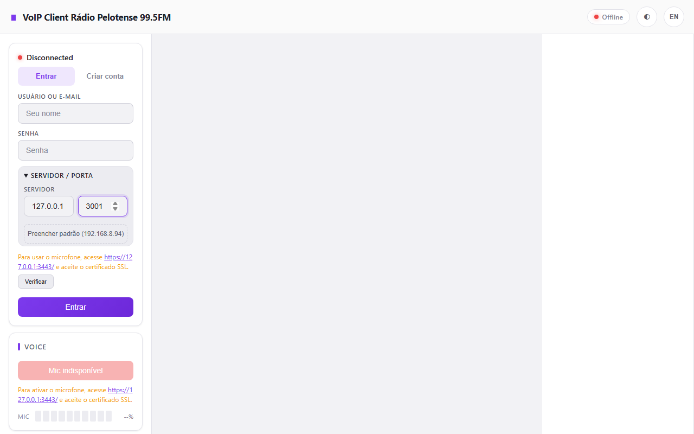 | 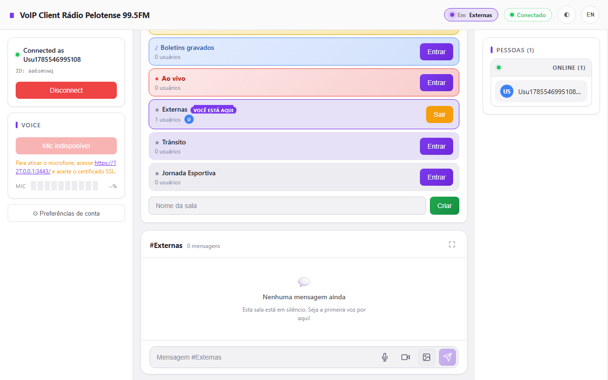 | 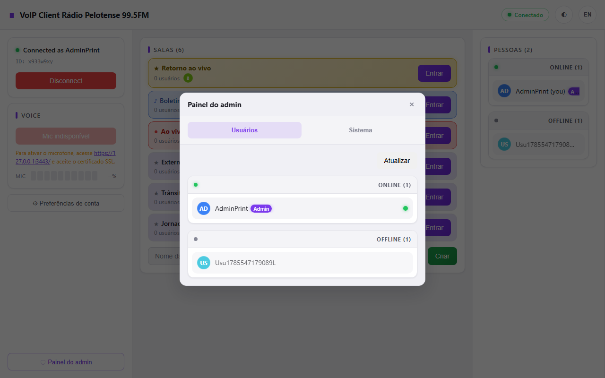 |

#### Modo escuro

| Login / Registro | Salas e chat | Painel do admin |
| --- | --- | --- |
| 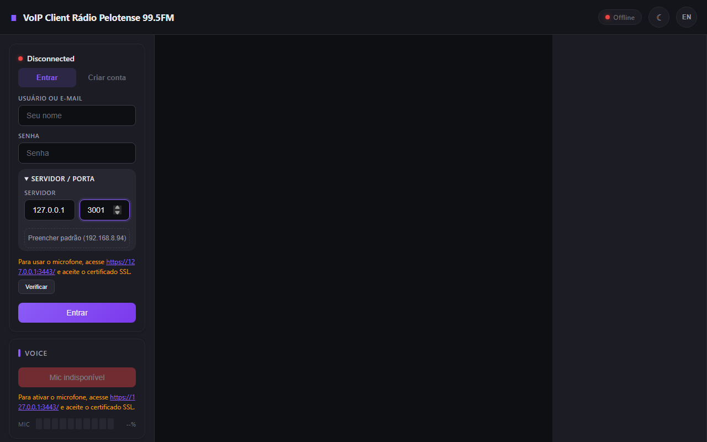 | 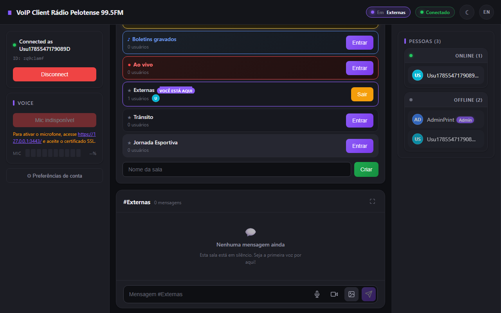 | 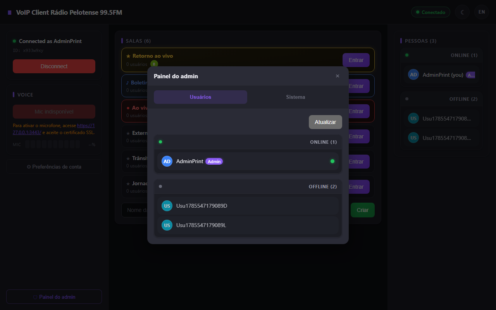 |

### Versão nova — 04/08/2026

#### Modo claro

| Login / Registro | Salas e chat | Painel do admin |
| --- | --- | --- |
| 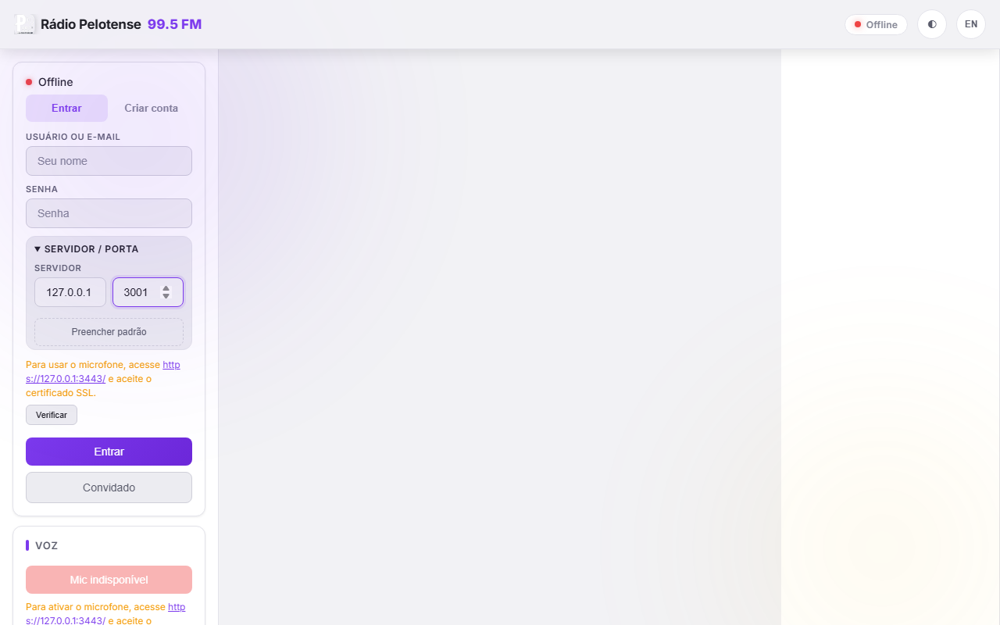 | 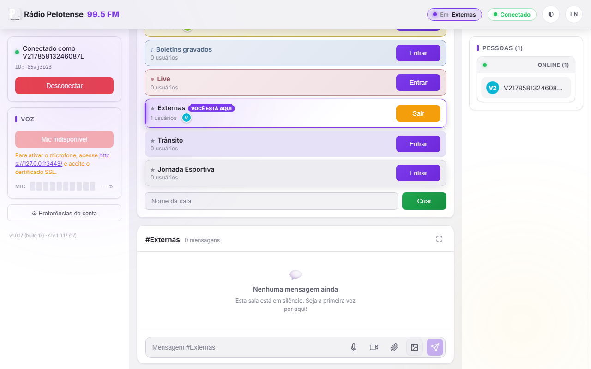 | 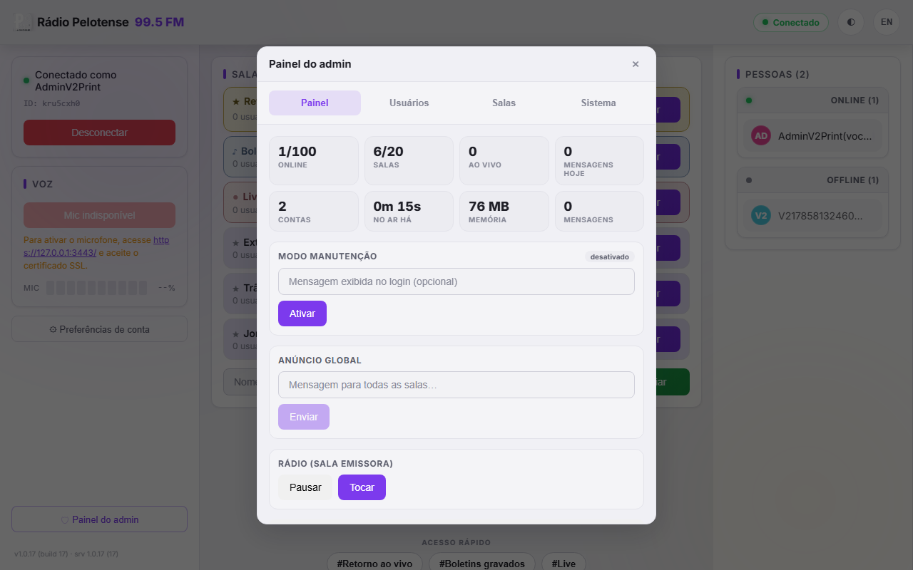 |

#### Modo escuro

| Login / Registro | Salas e chat | Painel do admin |
| --- | --- | --- |
| 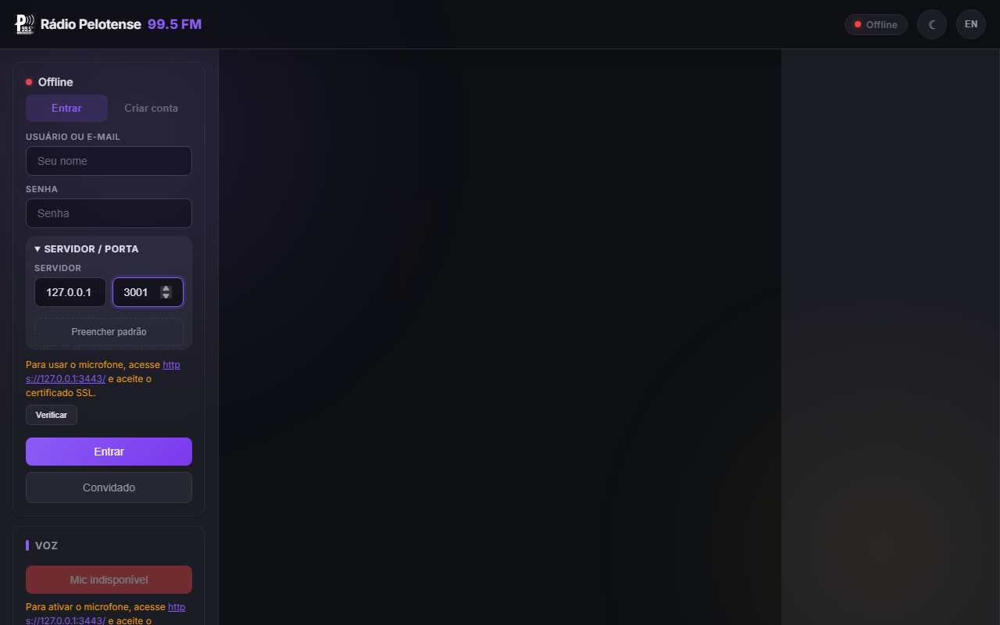 | 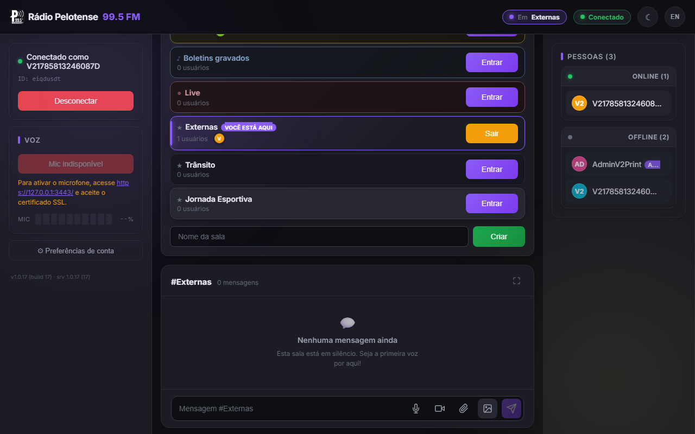 | 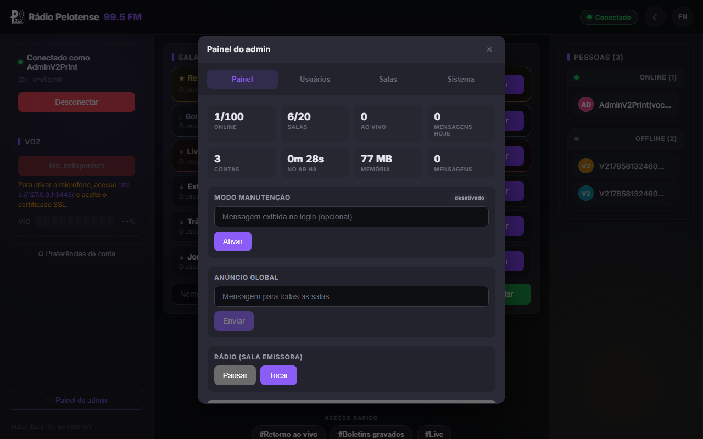 |

---

## Estrutura do projeto

```
voip-project/
├── server/        # Servidor Node.js + TypeScript
│   ├── src/
│   │   ├── clients/       # Gerenciador de clientes conectados
│   │   ├── config/        # Configuração via variáveis de ambiente
│   │   ├── network/       # WebSocket (wsHandler)
│   │   ├── rooms/         # Gerenciador de salas
│   │   ├── storage/       # Persistência em SQLite (salas, mensagens, DMs, contas)
│   │   ├── types/         # Tipos e contratos do protocolo
│   │   ├── utils/         # Certificados, logger
│   │   └── __tests__/     # Testes do servidor (vitest)
│   └── package.json
├── client/        # Cliente React + Vite + Tauri
│   └── src/
│       ├── components/    # Componentes de UI (Chat, Salas, Usuários, Rádio, etc.)
│       ├── stores/        # Zustand (conexão, salas, conta, voz, DM, ...)
│       ├── services/      # WebSocket, histórico local, notificações, rádio
│       ├── hooks/         # Microfone, alto-falante, gravação, voz
│       ├── audio/         # Codec Opus, encoder, decoder, speaker
│       ├── i18n/          # Traduções PT/EN
│       ├── ui/            # Avatares, bot do rádio
│       ├── utils/         # Imagem, download (WAV), etc.
│       └── __tests__/     # Testes do cliente (vitest)
└── package.json    # Scripts raiz
```

---

## Servidor

### Tecnologias

- Node.js + TypeScript
- Fastify + `@fastify/static` (servir o cliente buildado e HTTP)
- `ws` (WebSocket/WebSocket Secure)
- `dgram` (UDP de voz)
- `better-sqlite3` (persistência)
- `nodemailer` (e-mail de confirmação de conta)
- `selfsigned` (certificados SSL de desenvolvimento)
- `dotenv` (variáveis de ambiente)

### Configuração

```bash
cd server
npm install
cp .env.example .env
npm run dev
```

### Variáveis de ambiente

| Variável                | Padrão            | Descrição                                    |
| ----------------------- | ----------------- | -------------------------------------------- |
| `HOST`                  | `0.0.0.0`         | Host onde o servidor escuta                  |
| `SERVER_PORT`           | `3000`            | Porta HTTP (client buildado + health)        |
| `WS_PORT`               | `3001`            | Porta WebSocket (ws://)                      |
| `WSS_PORT`              | `3003`            | Porta WebSocket Secure (wss://)              |
| `HTTPS_CLIENT_PORT`     | `3443`            | Porta HTTPS do cliente (para microfone)      |
| `UDP_PORT`              | `3002`            | Porta UDP de voz                             |
| `MAX_USERS`             | `100`             | Máximo de clientes conectados                |
| `MAX_ROOMS`             | `20`              | Máximo de salas                              |
| `MAX_WS_PAYLOAD`        | `2GB`             | Tamanho máximo de payload do WebSocket       |
| `DB_PATH`               | `./data/voip.db`  | Caminho do banco SQLite (persistência)       |
| `ADMIN_NAMES`           | *(vazio)*          | Nomes de usuários com papel de admin (lista separada por vírgula) |
| `ADMIN_IDS`             | *(vazio)*          | IDs de usuários com papel de admin (lista separada por vírgula) |
| `LOG_LEVEL`             | `INFO`            | Nível de log: `DEBUG`/`INFO`/`WARN`/`ERROR`  |
| `NGROK_AUTHTOKEN`       | *(vazio)*          | Token do ngrok — inicia o túnel ngrok automaticamente |
| `NGROK_DOMAIN`          | *(vazio)*          | Subdomínio fixo do ngrok (pago)             |
| `CLOUDFLARED`           | *(vazio)*          | `true` para iniciar o Cloudflare Tunnel automaticamente |
| `SMTP_HOST`             | *(vazio)*          | Host SMTP para envio de e-mail de confirmação de conta |
| `SMTP_PORT`             | `587`             | Porta SMTP                                  |
| `SMTP_SECURE`           | `false`           | Usa TLS/SSL no SMTP (`true`/`false`)        |
| `SMTP_USER`             | *(vazio)*          | Usuário SMTP (se houver autenticação)       |
| `SMTP_PASS`             | *(vazio)*          | Senha SMTP                                  |
| `SMTP_FROM`             | `no-reply@voip.local` | Remetente dos e-mails                     |
| `APP_NAME`              | `VoIP Rádio Pelotense` | Nome exibido nos e-mails                  |

#### Limites de segurança

| Variável                  | Padrão  | Descrição                          |
| ------------------------- | ------- | ---------------------------------- |
| `MAX_NAME_LENGTH`         | `32`    | Máx. caracteres no nome            |
| `MAX_PASSWORD_LENGTH`     | `128`   | Máx. caracteres na senha           |
| `MAX_ROOM_NAME_LENGTH`    | `64`    | Máx. caracteres no nome da sala    |
| `MAX_TEXT_LENGTH`         | `4000`  | Máx. caracteres na mensagem        |
| `MAX_AUDIO_MESSAGE_BYTES` | `512KB` | Máx. bytes de mensagem de áudio    |
| `MAX_VIDEO_MESSAGE_BYTES` | `2MB`   | Máx. bytes de mensagem de vídeo    |
| `MAX_IMAGE_MESSAGE_BYTES` | `5MB`   | Máx. bytes de imagem               |
| `MAX_LIVE_CHUNK_BYTES`    | `512KB` | Máx. bytes por chunk de live       |
| `MAX_VOICE_FRAME_BYTES`   | `64KB`  | Máx. bytes por frame de voz        |
| `MAX_AVATAR_BYTES`        | `2MB`   | Máx. bytes do avatar (upload)      |

### Build

```bash
cd server
npm run build      # gera dist/ (tsc)
npm start          # roda o build
```

---

## Cliente

### Tecnologias

- React 18 + TypeScript + Vite
- Tauri (desktop)
- Zustand (estado global)
- Web Audio API (captura/reprodução)
- WebCodecs (codec Opus com fallback PCM)
- i18n PT/EN
- PWA (manifest + service worker + notificações)

### Configuração

```bash
cd client
npm install
npm run dev        # navegador (http)
npm run tauri dev  # desktop (Tauri)
```

Para apontar o cliente para um servidor específico no build, use a variável `VITE_SERVER_HOST`:

```bash
VITE_SERVER_HOST=192.168.8.94 npm run dev
```

---

## Protocolo

### Mensagens WebSocket

| Tipo                     | Direção          | Descrição                                        |
| ------------------------ | ---------------- | ------------------------------------------------ |
| `login`                  | cliente → servidor | Autentica (nick ou e-mail + senha; `email` e `confirmCode` opcionais) |
| `welcome`                | servidor → cliente | Confirma login (id, nome, admin, avatar, email) |
| `email_required`         | servidor → cliente | Conta nova exige e-mail (criação)              |
| `confirm_required`       | servidor → cliente | Código de confirmação enviado; aguarda o código |
| `join_room` / `leave_room` | cliente → servidor | Entra / sai de uma sala                        |
| `create_room` / `delete_room` | cliente → servidor | Cria / exclui sala temporária                |
| `list_rooms` / `list_users` | cliente → servidor | Pede lista de salas / usuários                |
| `room_list` / `user_list` | servidor → cliente | Envia lista de salas / usuários                |
| `chat_message`           | ambos            | Mensagem de texto na sala                        |
| `chat_audio_message` / `chat_video_message` / `chat_image_message` | ambos | Mensagens de mídia na sala |
| `message_reaction`       | ambos            | Reação emoji em uma mensagem                     |
| `forward_message`        | cliente → servidor | Encaminha mensagem para outra sala             |
| `delete_message`         | cliente → servidor | Apaga mensagem (autor ou admin)                |
| `private_message` / `private_audio_message` / `private_video_message` | ambos | DM de texto / áudio / vídeo |
| `list_private_messages`  | cliente → servidor | Pede histórico de DM com um usuário            |
| `private_history`        | servidor → cliente | Envia histórico de DM                          |
| `update_profile`         | cliente → servidor | Atualiza nome, e-mail, senha e/ou avatar       |
| `profile_updated`        | servidor → cliente | Confirma atualização de perfil                 |
| `live_start` / `live_stop` / `live_chunk` / `live_request*` / `live_force_stop` | ambos | Controle da transmissão ao vivo |
| `heartbeat`              | ambos            | Keep-alive / detecção de conexões mortas        |

### Pacote UDP (binário, voz)

```
[Version:1B][Type:1B][UserID:8B][RoomID:4B][Sequence:4B][Timestamp:8B][Payload:N]
```

O frame binário também é roteado pelo WebSocket em alguns fluxos (voz via WS quando necessário), sempre anexando o `userId` no início para identificar quem fala.

---

## Pipeline de áudio

```
Microfone → PCM → Encoder (Opus/PCM) → UDP → Servidor → UDP → Clientes → Decoder → Alto-falante
```

- **Opus** via WebCodecs quando disponível, com **fallback automático para PCM**.
- O servidor não processa o áudio: apenas replica os pacotes para os demais clientes da sala.

---

## Testes

```bash
npm test                  # roda servidor + cliente
npm run test:server       # só servidor (vitest)
npm run test:client       # só cliente (vitest)
```

Suite atual: **134 testes no servidor + 267 no cliente**.

### Teste E2E da live (Playwright)

Há um teste visual de ponta a ponta que sobe o servidor, abre dois navegadores reais
(transmissor + espectador, com câmera fake do Chromium) e verifica que o espectador
**realmente recebe o vídeo** (não preto). Ele também gera screenshots em `e2e/artifacts/`.

```bash
npx playwright install chromium   # só na primeira vez
npm run e2e                       # builda cliente/servidor, sobe o server e roda o teste
```

O teste (`e2e/live.spec.ts`) valida que o `<video>` do espectador tem `srcObject`, frames
decodificados (`videoWidth > 0`) e **pixels não pretos** — foi o teste que detectou e
confirmou a correção da live preta.

---

## Scripts raiz

| Script                 | Descrição                                      |
| ---------------------- | ---------------------------------------------- |
| `server:dev`           | Sobe o servidor em modo dev                    |
| `server:build`         | Builda o servidor                              |
| `client:dev`           | Sobe o cliente Vite                            |
| `client:build`         | Builda o cliente (tsc + vite)                  |
| `client:tauri`         | Roda o cliente via Tauri                       |
| `serve`                | Builda o cliente e sobe o servidor servindo o dist |
| `test` / `test:server` / `test:client` | Testes (vitest) |
| `e2e` | Teste E2E da live (Playwright, navegador real + câmera fake) |
| `e2e:server` | Builda cliente/servidor e sobe o servidor para o E2E |

---

## Notas

- Em `http://` (sem HTTPS), o microfone fica indisponível por política de autoplay; para usá-lo, acesse o cliente via `https://<host>:3443/` e aceite o certificado SSL (ou use o cliente buildado servido pelo servidor).
- O diretório `server/data/` (banco SQLite) e `server/certs/` (certificados) estão no `.gitignore` e não devem ser versionados.
